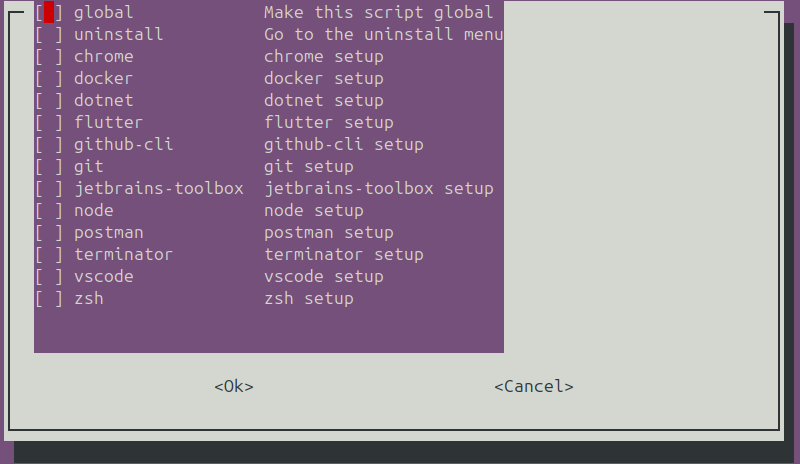
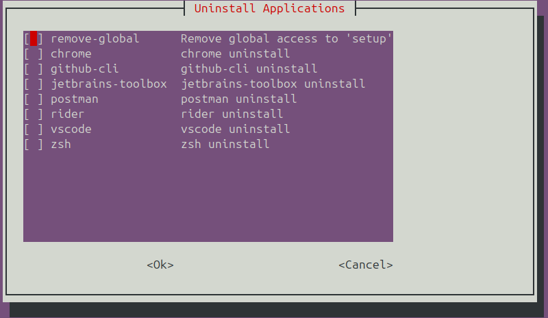

# 🚀 Ubuntu Setup Automation

Easily bootstrap your Ubuntu environment with a beautiful interactive menu and script automation. Install your favorite tools, set global aliases, and even uninstall them later — all with a single command.

---

## 📦 Features

- ✅ Install apps with an interactive checklist menu
- 🌍 Option to make the setup globally accessible via the `setup` command
- 🧼 Uninstall any installed app from a similar interactive menu
- 🛠️ Scripts are modular and easy to extend (`apps/` folder)
- 🧙‍♂️ Custom aliases are linked automatically when using ZSH
- 🧾 All actions are logged in `install.log`

---

## ⚙️ Usage

### 1. Clone this repo

```bash
git clone https://github.com/michelpl/ubuntu-setup.git
cd ubuntu-setup
chmod +x setup.sh
```

### 2. Run the setup

```bash
./setup.sh
```



You'll see a terminal menu where you can:

- Select which apps to install (e.g., Chrome, VSCode, Postman, etc.)
- Enable the **Global** option to run this script from anywhere as `setup`
- Choose to enter the **Uninstall** menu

### 3. (Optional) Run from anywhere

If you selected the `Global` option, you can now use:

```bash
setup        # opens the install menu
setup uninstall  # opens the uninstall menu
```

---

## 🔁 Uninstalling Apps

You can uninstall apps at any time:

```bash
setup uninstall
```



You’ll be presented with a checklist of all installed apps (with uninstall scripts) and the option to **remove the global `setup` command**.

---

## 🗂️ Project Structure

```
ubuntu-setup/
├── setup.sh               # Main entry point
├── apps/
│   ├── chrome.sh          # App install scripts
│   ├── vscode.sh
│   └── uninstall/
│       ├── chrome-uninstall.sh
│       └── vscode-uninstall.sh
├── configs/
│   └── aliases.zsh        # Custom aliases
└── install.log            # Logs of all actions
```

---

## ✍️ Adding a New App

1. Create an install script inside `apps/`:
   ```bash
   apps/mytool.sh
   ```
2. (Optional) Create a matching uninstall script:
   ```bash
   apps/uninstall/mytool-uninstall.sh
   ```
3. It will automatically appear in the setup and uninstall menus.

---

## 🧑‍💻 Requirements

- Ubuntu (tested on 22.04+)
- `whiptail` (`sudo apt install whiptail`)
- Internet connection
- Permissions to install packages (`sudo`)

---

## 📖 License

MIT License © Michel Lima

---

> Made for devs who hate setting things up manually.