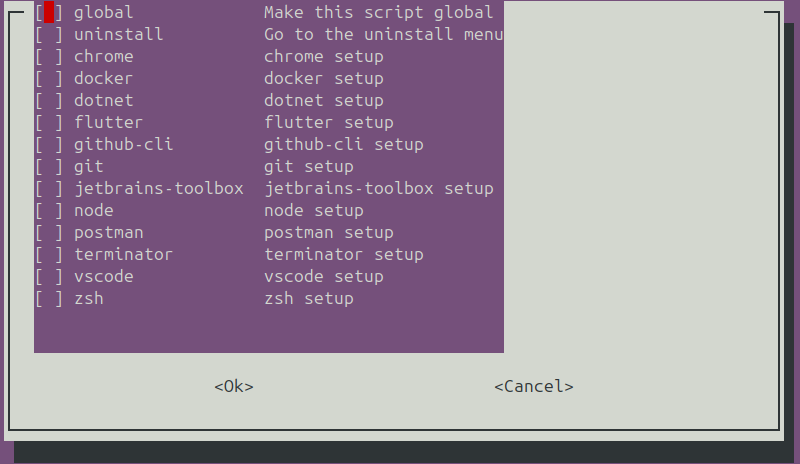
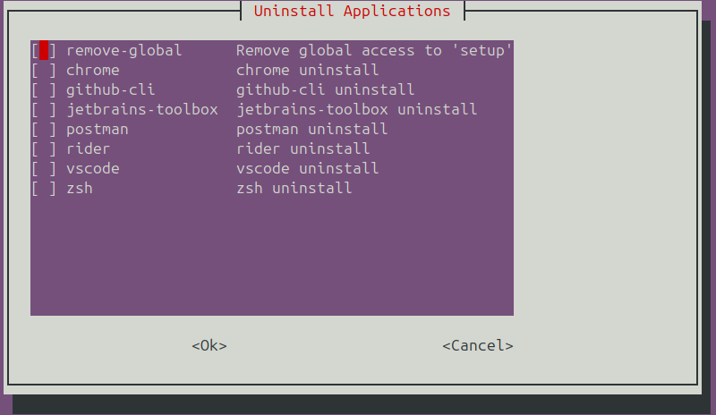

# 🚀 Linux Dev Setup Automation

Easily bootstrap your Ubuntu environment with a beautiful interactive menu and script automation. Install your favorite tools, set global aliases, and even uninstall them later — all with a single command.

---

## 📦 Features

- ✅ Install apps with an interactive checklist menu
- 🌍 Option to make the setup globally accessible via the `setup` command
- 🧼 Uninstall any installed app from a similar interactive menu
- 🛠️ Scripts are modular and easy to extend (`apps/` folder)
- 🧙‍♂️ Custom aliases are linked automatically when using ZSH
- 🧾 All actions are logged in `install.log`

---

## ⚡ Quick install via curl (Ubuntu)

If you want to start with a minimal setup, run:

```bash
curl -fsSL https://raw.githubusercontent.com/michelpl/linux-dev-setup/main/script.sh | bash
```

This script (`script.sh`) is compatible with Ubuntu, installs `git` and the GitHub CLI (`gh`), waits for GitHub login, creates `~/projects`, and clones `michelpl/linux-dev-setup` into `~/projects/linux-dev-setup`.

---

## Homeserver host setup

Prepare an Ubuntu machine (post-install) to run the [homeserver](https://github.com/michelpl/homeserver) Docker stacks: Docker Engine, Tailscale package, SSH hardening, UFW, fail2ban, unattended security upgrades, and always-on power settings. Tailscale **auth** (`tailscale up`) and application stacks live in the homeserver repo.

### Quick path

```bash
curl -fsSL https://raw.githubusercontent.com/michelpl/linux-dev-setup/main/script.sh | bash
cd ~/projects/linux-dev-setup/Ubuntu
./setup.sh i homeserver-host
# Log out and back in if you were added to the docker group
```

### What `homeserver-host` installs

| App | Purpose |
|-----|---------|
| `docker` | Docker Engine + Compose v2, enabled on boot |
| `tailscale` | Tailscale package + `tailscaled` (no auth) |
| `openssh-hardening` | SSH key-only auth, drop-in `99-homeserver.conf` |
| `ufw` | Firewall: deny incoming except SSH |
| `fail2ban` | sshd jail |
| `unattended-upgrades` | Automatic security updates |
| `homeserver-power` | Always-on: mask suspend/hibernate + logind/GNOME policy |

**Before hardening SSH on a remote machine:** ensure your public key is in `~/.ssh/authorized_keys`.

See [docs/homeserver-host.md](docs/homeserver-host.md) for the full flow into the homeserver repository.

---

## ⚙️ Usage

### 1. Clone this repo

```bash
git clone https://github.com/michelpl/linux-dev-setup.git
cd linux-dev-setup/Ubuntu
chmod +x setup.sh
```

### 2. Run the setup

```bash
./setup.sh
```



You'll see a terminal menu where you can:

- Select which apps to install (e.g., Chrome, VSCode, Postman, etc.)
- Enable the **Global** option to run this script from anywhere as `setup`
- Choose to enter the **Uninstall** menu

### 3. (Optional) Run from anywhere

If you selected the `Global` option, you can now use:

```bash
setup        # opens the install menu
setup uninstall  # opens the uninstall menu
```

---

## 🔁 Uninstalling Apps

You can uninstall apps at any time:

```bash
setup uninstall
```



You’ll be presented with a checklist of all installed apps (with uninstall scripts) and the option to **remove the global `setup` command**.

---

## 🗂️ Project Structure

```
linux-dev-setup/Ubuntu
├── setup.sh               # Main entry point
├── apps/
│   ├── chrome.sh          # App install scripts
│   ├── vscode.sh
│   └── uninstall/
│       ├── chrome-uninstall.sh
│       └── vscode-uninstall.sh
├── configs/
│   └── aliases.zsh        # Custom aliases
└── install.log            # Logs of all actions
```

Re-running `Ubuntu/apps/zsh.sh` upgrades the `zsh` package and Oh My Zsh (when possible) and refreshes the `~/.aliases.zsh` symlink to `configs/aliases.zsh`, so alias changes in the repo apply on the next shell reload (`refresh-zsh` or a new terminal).

---

## ✍️ Adding a New App or Contributing

Want to add a new app or improve the setup? Contributions are welcome!

1. Create an install script inside `Ubuntu/apps/`:
   ```bash
   Ubuntu/apps/mytool.sh
   ```
2. (Optional) Create a matching uninstall script:
   ```bash
   Ubuntu/apps/uninstall/mytool-uninstall.sh
   ```
3. Your app will automatically appear in the setup and uninstall menus.
4. Open a Pull Request with your changes!

See [CONTRIBUTING.md](CONTRIBUTING.md) for more details.

---

## 🚀 Usage

- To install an app:
  ```bash
  ./setup.sh i <appname>
  # or, if globally installed:
  setup i <appname>
  ```
- To uninstall an app:
  ```bash
  ./setup.sh u <appname>
  # or, if globally installed:
  setup u <appname>
  ```
- To use the interactive menu:
  ```bash
  ./setup.sh
  # or
  setup
  ```

---

## 🧑‍💻 Requirements

- Ubuntu (tested on 24.04+)
- `whiptail` (`sudo apt install whiptail`)
- Internet connection
- Permissions to install packages (`sudo`)

---

## 📖 License

MIT License © 
---

> Made for devs who hate setting things up manually.
